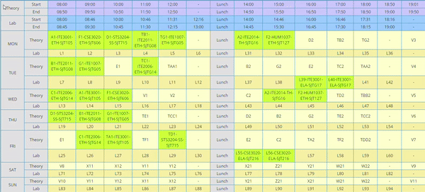

# Electron Time Table


Electron app to show college Time Table.

## Run locally

```cmd
npm install
npm start
```

## Package to Windows .exe files

```cmd
npm run package-win-32
npm run package-win-64
```

Files will be available in `release-builds` folder.

## Make distributables for Windows x64

```cmd
npm run make
```

Files will be available in `out` folder.

## Download executable

Head over to [releases](https://github.com/adityachandak287/electron-time-table/releases) to download the latest release.

1. Download appropriate zip file
2. Extract
3. Run `VIT-Time-Table.exe`

## How to use?

Main window on first launch


On clicking on Set Time Table


Copy Time Table from VTOP



Paste it into the textarea and click set time-table to parse the data and store the result for future use.


Main window once Time Table is set


## To-Do:

- [ ] Show upcoming class
- [ ] Colour out completed classes
- [ ] System notification for upcoming class
- [ ] setInterval to udpate day
